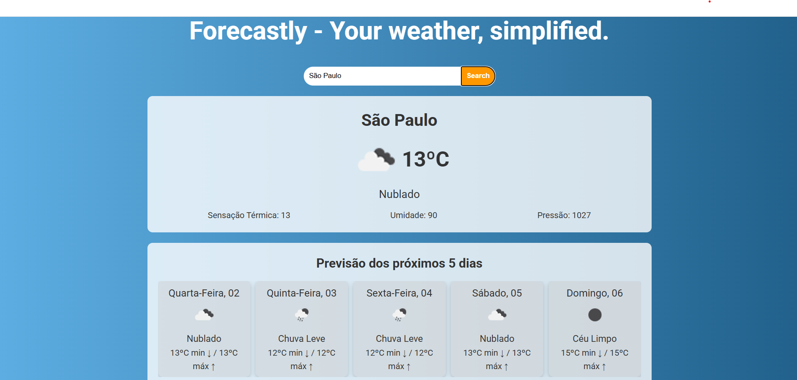

# 🌦️ Forecastly, your weather simplified.

**Forecastly** é uma aplicação web que fornece informações meteorológicas em tempo real para qualquer cidade do mundo. Desenvolvida com React e JavaScript, ela busca dados atualizados de previsão do tempo utilizando a API da OpenWeather.

---

## 📸 Demonstração



---

## 🚀 Funcionalidades

- 🔍 Busca de cidades
- 🌤️ Exibição do clima atual
- 📅 Previsão para os próximos 5 dias
- 🧭 Informações como temperatura atual, temperatura máxima e mínima, umidade, sensação térmica, pressão
- 📱 Responsivo: funciona bem em celulares e desktops

---

## 🛠️ Tecnologias Utilizadas

- [React](https://reactjs.org/)
- [JavaScript](https://developer.mozilla.org/pt-BR/docs/Web/JavaScript)
- [Axios](https://axios-http.com/)
- [OpenWeather API](https://openweathermap.org/api)


---

## 📦 Instalação

```bash
# Clone o repositório
git clone https://github.com/kaah-kz/forecastly.git

# Acesse a pasta do projeto
cd forecastly

# Instale as dependências
npm install

# Rode o projeto
npm run dev

Nota: Certifique-se de ter o Node.js e o npm instalados com versão atualizada.

🔑 API Key
Este projeto usa a API do OpenWeather. Para que ele funcione corretamente:

-Crie uma conta no OpenWeather e gere uma API Key gratuita.

-No App.jsx onde a API_KEY é utilizada, substitua a chave pelo seu token:

const key = "SUA_API_KEY_AQUI"

🤝 Contribuições
Contribuições são bem-vindas!

Obrigada por visitar meu perfil! 💜
